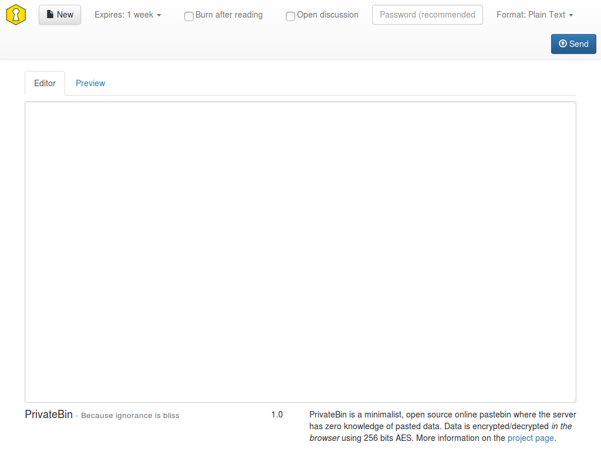

<!--
N.B.: This README was automatically generated by https://github.com/YunoHost/apps/tree/master/tools/README-generator
It shall NOT be edited by hand.
-->

# Zerobin for YunoHost

[](https://dash.yunohost.org/appci/app/zerobin)    
[](https://install-app.yunohost.org/?app=zerobin)

*[Lire ce readme en français.](./README_fr.md)*

> *This package allows you to install Zerobin quickly and simply on a YunoHost server.
If you don't have YunoHost, please consult [the guide](https://yunohost.org/#/install) to learn how to install it.*

## Overview

PrivateBin is a minimalist, open source online pastebin where the server has zero knowledge of pasted data.

Data is encrypted/decrypted in the browser using 256bit AES in Galois Counter mode.

This is a fork of ZeroBin, originally developed by Sébastien Sauvage. It was refactored to allow easier and cleaner extensions and has now much more features than the original. It is however still fully compatible to the original ZeroBin 0.19 data storage scheme. Therefore such installations can be upgraded to this fork without loosing any data.


**Shipped version:** 1.3.5~ynh2


**Demo:** https://privatebin.net/

## Screenshots



## Disclaimers / important information

## Additional information

In the [update documentation](https://github.com/PrivateBin/PrivateBin/wiki/Configuration#zerobincompatibility) of PrivateBin, it is specified that:

For full compatibility with ZeroBin and to be able to decrypt old pastes, you would enable this option. However this is not recommend for new installations as it weakens the security of your PrivateBin instance.

This means that we have decided to delete the directory that allows us to save the data. You can save the 'data' directory, if you want to keep your data. But you should know that this weakens the security of this application.

## Documentation and resources

* Official app website: <https://privatebin.info/>
* Official admin documentation: <https://github.com/PrivateBin/PrivateBin/wiki>
* Upstream app code repository: <https://github.com/PrivateBin/PrivateBin>
* YunoHost documentation for this app: <https://yunohost.org/app_zerobin>
* Report a bug: <https://github.com/YunoHost-Apps/zerobin_ynh/issues>

## Developer info

Please send your pull request to the [testing branch](https://github.com/YunoHost-Apps/zerobin_ynh/tree/testing).

To try the testing branch, please proceed like that.

``` bash
sudo yunohost app install https://github.com/YunoHost-Apps/zerobin_ynh/tree/testing --debug
or
sudo yunohost app upgrade zerobin -u https://github.com/YunoHost-Apps/zerobin_ynh/tree/testing --debug
```

**More info regarding app packaging:** <https://yunohost.org/packaging_apps>
