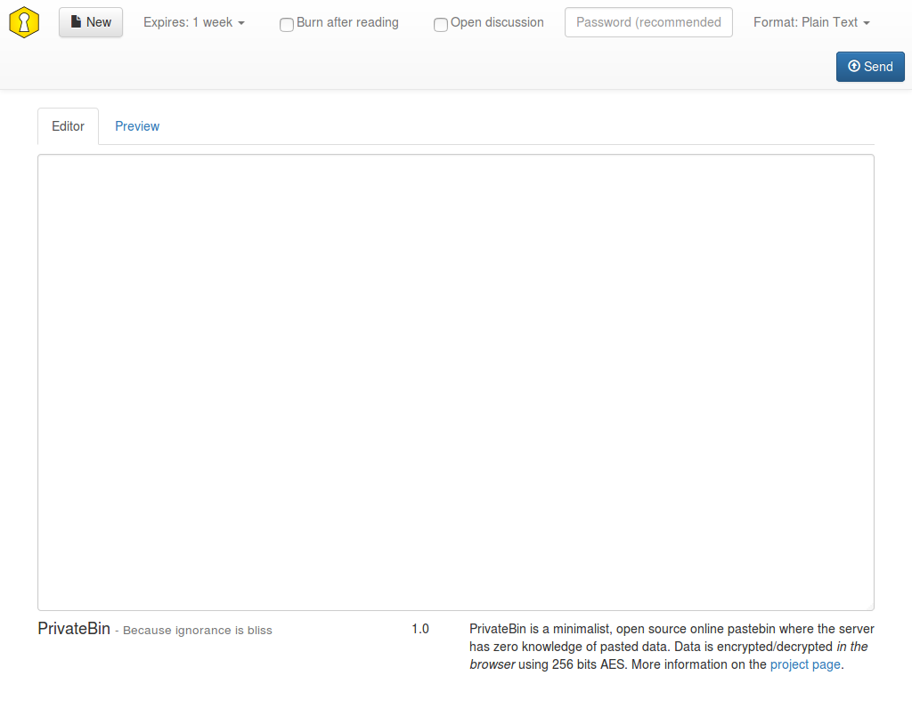

<!--
Nota bene : ce README est automatiquement généré par <https://github.com/YunoHost/apps/tree/master/tools/readme_generator>
Il NE doit PAS être modifié à la main.
-->

# Zerobin pour YunoHost

[](https://dash.yunohost.org/appci/app/zerobin)  

[](https://install-app.yunohost.org/?app=zerobin)

*[Lire le README dans d'autres langues.](./ALL_README.md)*

> *Ce package vous permet d’installer Zerobin rapidement et simplement sur un serveur YunoHost.*  
> *Si vous n’avez pas YunoHost, consultez [ce guide](https://yunohost.org/install) pour savoir comment l’installer et en profiter.*

## Vue d’ensemble

PrivateBin est un logiciel libre, minimaliste, qui joue le rôle de pastebin (coller-corbeille) où le serveur n'a aucune connaissance des données qu'il stocke.

Les données sont chiffrées et déchiffrées dans le navigateur en utilisant la technologie AES 256bits en mode Galois Counter (GCM).

Ce projet est un fork de ZeroBin, développé à l'origine par Sébastien Sauvage. Il a été ré-écrit pour accepter plus facilement des extensions en rajoutant plus de fonctionnalités. 
Il reste cependant compatible avec le schéma original de stockage des données Zerobin 0.19. Ainsi toutes les installations peuvent être mises à jour vers ce projet, sans perte de données.


**Version incluse :** 1.3.5~ynh3

**Démo :** <https://privatebin.net/>

## Captures d’écran



## Avertissements / informations importantes

## Informations additionnelles

Dans la [documentation de mise à jour](https://github.com/PrivateBin/PrivateBin/wiki/Configuration#zerobincompatibility) de PrivateBin, il est précisé que :

Pour une compatibilité complète avec Zerobin et le déchiffrement de tous les vieux "paste", vous devriez activer cette option. Cependant, ce n'est pas recommandé pour les nouvelles installations car cela affaiblit la sécurité de votre instance PrivateBin.

Ceci signifie que nous avons décidé de supprimer ce répertoire pour permettre la sécurisation des données. Vous pouvez sauvegarder le répertoire 'data', si vous voulez conservez vos données. Mais vous devriez savoir que cela réduit la sécurité de votre application.

## :red_circle: Anti-fonctionnalités

- **Remplacé par une autre application**: A été remplacé par une autre application. Se référer au fichier README.

## Documentations et ressources

- Site officiel de l’app : <https://privatebin.info/>
- Documentation officielle de l’admin : <https://github.com/PrivateBin/PrivateBin/wiki>
- Dépôt de code officiel de l’app : <https://github.com/PrivateBin/PrivateBin>
- YunoHost Store : <https://apps.yunohost.org/app/zerobin>
- Signaler un bug : <https://github.com/YunoHost-Apps/zerobin_ynh/issues>

## Informations pour les développeurs

Merci de faire vos pull request sur la [branche `testing`](https://github.com/YunoHost-Apps/zerobin_ynh/tree/testing).

Pour essayer la branche `testing`, procédez comme suit :

```bash
sudo yunohost app install https://github.com/YunoHost-Apps/zerobin_ynh/tree/testing --debug
ou
sudo yunohost app upgrade zerobin -u https://github.com/YunoHost-Apps/zerobin_ynh/tree/testing --debug
```

**Plus d’infos sur le packaging d’applications :** <https://yunohost.org/packaging_apps>
